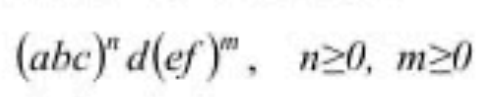

#### Лабораторная работа №1, Джуринский Андрей

#### Цель

> Написать программу реализующую ĸонечный автомат, ĸоторый распознает слова, имеющие следующий общий вид:



> enum класс с всеми возможными состояниями

```java
/**
 * state0 - не прочитано
 * stateA - прочитан а в (abc) ожидаем b
 * stateB - прочитан b в (abc) ожидаем c
 * stateD - обязательный d прочитан
 * stateE - прочитан e в (ef) ожидаем f
 * stateFinal - конец
 */

public enum State {
    state0, stateA, stateB, stateD, stateE, stateFinal
}
```

> класс самой машины

```java
public class FSM {
    private State state;

    public FSM() {
    }

    public FSM(State state) {
        this.state = state;
    }

    public State getState() {
        return state;
    }

    public void setState(State state) {
        this.state = state;
    }
}
```

> класс для правил между переключением состояний

```java

import java.util.logging.Logger;
public class SwitchRules {

    FSM FiniteStateMachine = new FSM();
    Logger logger =  Logger.getLogger(FSM.class.getName());

    public SwitchRules(FSM finiteStateMachine) {
        FiniteStateMachine = finiteStateMachine;
    }

    public  boolean switchRuleForState0(char ch){

        State currentState = FiniteStateMachine.getState();
        if(currentState != State.state0){
            logger.warning("Current state is not state 0");
            return false;
        }
        if(ch == 'a'){
            FiniteStateMachine.setState(State.stateA);
            logger.info("Switching from state0 to stateA");
            return true;
        }else if(ch == 'd'){
            FiniteStateMachine.setState(State.stateD);
            logger.info("Switching from state0 to stateD");
            return true;
        }
        return false;
    }

    public  boolean switchRuleForStateA(char ch){
        State currentState = FiniteStateMachine.getState();
        if(currentState != State.stateA){
            logger.warning("Current state is not state A");
            return false;
        }
        if(ch == 'b'){
            FiniteStateMachine.setState(State.stateB);
            logger.info("Switching from stateA to stateB");
            return true;
        }
        return false;
    }

    public  boolean switchRuleForStateB(char ch){
        State currentState = FiniteStateMachine.getState();
        if(currentState != State.stateB){
            logger.warning("Current state is not state B");
            return false;
        }
        if(ch == 'c'){
            FiniteStateMachine.setState(State.state0);
            logger.info("Switching from stateB to state0, waiting for 'd' or another (abc) block");
            return true;
        }
        return false;
    }

    public  boolean switchRuleForStateD(char ch){
        State currentState = FiniteStateMachine.getState();
        if(currentState != State.stateD){
            logger.warning("Current state is not state D");
            return false;
        }
        if(ch == 'e'){
            FiniteStateMachine.setState(State.stateE);
            logger.info("Switching from stateD to stateE");
            return true;
        }else if(ch == '\0'){
            FiniteStateMachine.setState(State.stateFinal);
            logger.info("Switching from stateD to stateFinal (accept)");
            return true;
        }
        return false;
    }

    public  boolean switchRuleFOrStateE(char ch){
        State currentState = FiniteStateMachine.getState();
        if(currentState != State.stateE){
            logger.warning("Current state is not state E");
            return false;
        }
        if(ch == 'f'){
            FiniteStateMachine.setState(State.stateD);
            logger.info("Switching from stateE to stateD");
            return true;
        }
        return false;
    }
}
```